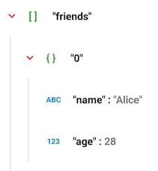

# Android JSON Viewer

[](https://www.buymeacoffee.com/pokeumcho)

[](https://jitpack.io/#pokeum/jsonviewer-compose/)

---

<div align="center">

### JSON Viewer and Beautifier

A lightweight package that will read JSON data, expand and collapse JSON view accordingly.

</div>

---

<div align="center">
  
https://github.com/pokeum/jsonviewer-xml/assets/102505472/e2f260f0-cc28-4607-9ec4-d9744ec9330c

</div>

---

**Easiest way to format Json String**

```kotlin
JsonViewerAdapter(jsonElement = {PUT_YOUR_JSON_ELEMENT})
```

## Table of Contents
- [Installation](#installation)
- [Usage](#usage)
    - [Basic](#basic)
    - [Advance](#advance)
- [Custom Styles](#styles)


## <a id="installation"> Installation

Add it in your root `build.gradle` at the end of repositories:

```gradle
allprojects {
  repositories {
    // ...
    maven { url 'https://jitpack.io' }
  }
}
```

Add the dependency

```gradle
implementation 'com.github.pokeum:jsonviewer-compose:0.0.0'
```

## <a id="usage"> Usage

- ## <a id="basic"> Basic

  ### JsonParser.parse()
  
  Convert `String` into a `JsonElement` object

  **Example - Parsing JSON**
  ```kotlin
  val jsonString = "{ \"abc\": \"def\",\"xyz\": 123 }"
            
  val jsonParser = JsonParser.Builder().build()
  val jsonElement: JsonElement? = try {
    jsonParser.parse(jsonString)
  }
  // Raise a JSONException if it is not a JSONObject or JSONArray.
  catch (e: JSONException) { null }
  ```

  ### Display JSON
  
  ```kotlin
  JsonViewerAdapter(jsonElement = {PUT_YOUR_JSON_ELEMENT})
  ```

- ## <a id="advance"> Advance

  ### JsonParser - Sort JSON

  **Example - Alphabetically**
  ```kotlin
  JsonParser.Builder()
    .setComparator(compareBy { it.key })
    .build()
  ```

## <a id="styles"> Custom Styles

### Color

|  |  |
| -- | -- |
| Key | `"friends"`, `"0"`, `"name"`, `"age"` |
| Value | `"Alice"`, `28` |
| Splitter | `:` |
| Type | `ABC`, `123` |
| Arrow | `∨` |
| Bracket | `[ ]`, `{ }` |
| Divider | `│` |

```kotlin
JsonViewerAdapter(
  // ...
  keyColor = JsonViewerColor(colorResource(R.color.key_color)),
  valueColor = JsonViewerColor(colorResource(R.color.value_color)),
  splitterColor = JsonViewerColor(colorResource(R.color.splitter_color)),
  typeColor = JsonViewerColor(colorResource(R.color.type_color)),
  arrowColor = JsonViewerColor(colorResource(R.color.arrow_color)),
  bracketColor = JsonViewerColor(colorResource(R.color.bracket_color)),
  dividerColor = JsonViewerColor(colorResource(R.color.divider_color))
)
```
